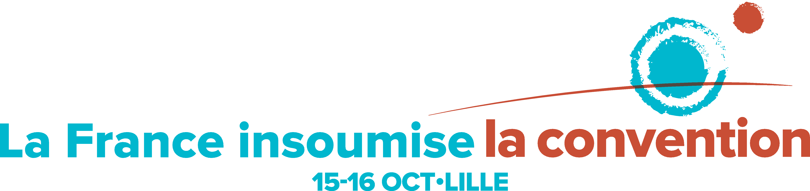

  

La première convention nationale de la France insoumise aura lieu à Lille les 15 et 16 octobre 2016.

Elle réunira **plus d’un millier de personnes**, représentatives du mouvement La France insoumise, qui s’est constitué depuis la proposition de candidature de Jean-Luc Mélenchon, le 10 février dernier.

Dans le prolongement  du « Défilé des insoumis » du 5 juin 2016 à Paris, **elle permettra de faire entendre celles et ceux qui incarnent la France insoumise** : des  syndicalistes, des lanceurs d’alerte, des militants pour la défense de l’environnement, des universitaires, des philosophes, des personnalités du monde de l’art et de la culture et des insoumis(es) qui témoigneront de leurs expériences du quotidien.

Elle constituera également **une étape dans la construction du projet « l’Avenir en commun »**, titre du programme en cours d’adoption par les 130 000 insoumis. La convention permettra **d’identifier les priorités programmatiques de la campagne** et enclenchera une phase de construction de livrets thématiques et d’ateliers législatifs qui préciseront nos propositions sur près de 40 sujets.

Enfin, elle sera l’occasion pour les insoumis de toute la France de **réfléchir collectivement aux méthodes et outils nécessaires pour faire progresser la France insoumise** : élargissement du mouvement, collecte des 500 parrainages, financement de la campagne, premières reflexions sur la campagne des 577 candidats qui porteront les couleurs du mouvement aux élections législatives.

D’ores et déjà, 200 bénévoles s’organisent pour mettre en place cette première convention, événement inédit qui sera conclu le dimanche 16 octobre à 11h30 par Jean-Luc Mélenchon.

*Manuel Bompard, directeur de campagne*

### Qui participe ?

Plus d’un millier de personnes participeront à la convention de la France insoumise.

* 650 insoumis tirés au sort parmi les plus de 130 000 signataires de la plateforme jlm2017.fr
* 250 acteurs des insoumissions sociales, écologiques ou démocratiques, des intellectuels et des représentants des groupes politiques qui soutiennent le mouvement.

L’ensemble des insoumis sera également invités à participer grâce à des méthodes interactives (réseaux sociaux, sms, vote en ligne).

### Comment s’est déroulé le tirage au sort ?

Le tirage au sort s’est déroulé  en plusieurs vagues successives :

* Mi-septembre, invitation par mail au 130 000 insoumis  à compléter les informations les concernant (adresse, âge, genre).
* Les tirages au sort ont eu lieu les 19, 21 et 27 septembre. A chaque vague, les tirés au sort ont été contactés pour s’assurer de leur présence et valider leur inscription.
* Début octobre : confirmation et validation des inscrits
